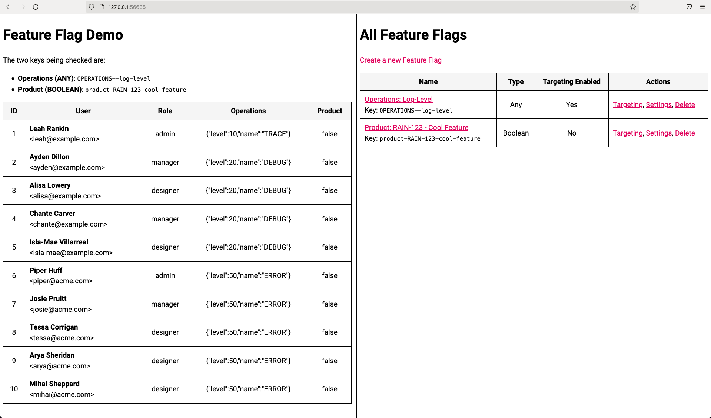

# Strangler: Playing With Feature Flags In ColdFusion

by [Ben Nadel][bennadel]

At [work][invision], I [use and **love** LaunchDarkly][blog-3766] as our feature flag system. However, with the high-_value_ of LaunchDarkly comes a relatively high-_cost_ (from a dollars-and-cents perspective); at least, it's "high" when you consider using feature flags in a personal project that doesn't make any money. As such, I wanted to see if I could create a _LaunchDarkly-inspired_ feature flag system for [my personal ColdFusion blog][bennadel].

This repository represents a **proof-of-concept** running in [Lucee CFML][lucee-cfml]. It contains two separate ColdFusion applications:

* **Admin** - located at `/admin/`.
* **Demo** - located at `/`.

Both ColdFusion applications load the same data file - a JSON file - that contains the feature flag information. The Admin application is used to create feature flags and manage the targeting (ie, which user-inputs see which "variant" of each feature flag). The Demo application is then used to apply that targeting against a set of sample users.

The Demo app runs as a `<frameset>` with the Demo on the left and the Admin on the right:



The **user interface** for this demo leaves **a lot to be desired**. I was trying to avoid going down a thick-client rabbit-hole. If I tried to make the UI "nice", this demo would have immediately become more about Angular than it was about feature flags. As such, configuring a feature flag is somewhat janky. The entire process is [driven by form `POST`-backs, using old-school submit buttons][blog-4296] (what do you know, traditional web technology still gets the job done). In a real-world scenario, the UI would be _much nicer_, I promise. Please suspend judgement.

## Reloading Feature Flags On Each Request

In this demo, the `Strangler.cfc` component is supplied with a "Sync Loader". This data loader _reloads_ and _recompiles_ the feature flag data at the top of each incoming request so that we can immediately see the effects of the targeting changes applied in the `/admin`. This is _not free_ of overhead. In a production app, you'd want to provide a loader that keeps the data cached for a longer period of time (an exercise for the reader).

## Running With CommandBox

This demo runs on Lucee CFML using CommandBox. To start the demo, `cd` into this folder and following these steps:

```sh
# Open the CommandBox CLI.
box

# Step down into the code directory.
cd ./code/

# Starts the Lucee CFML server (uses server.json by default)
# and opens it in your default browser.
start
```


[bennadel]: https://www.bennadel.com/ "Ben Nadel's blog on web development."

[blog-3766]: https://www.bennadel.com/blog/3766-my-personal-best-practices-for-using-launchdarkly-feature-flags.htm "Read article: My Personal Best Practices For Using LaunchDarkly Feature Flags"

[blog-4296]: https://www.bennadel.com/blog/4296-building-up-a-complex-objects-using-a-multi-step-form-workflow-in-coldfusion.htm "Read article: Building-Up A Complex Objects Using A Multi-Step Form Workflow In ColdFusion"

[invision]: https://www.invisionapp.com/

[lucee-cfml]: https://www.lucee.org/
